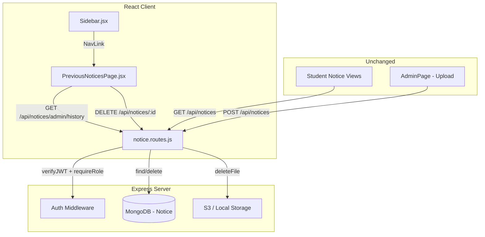
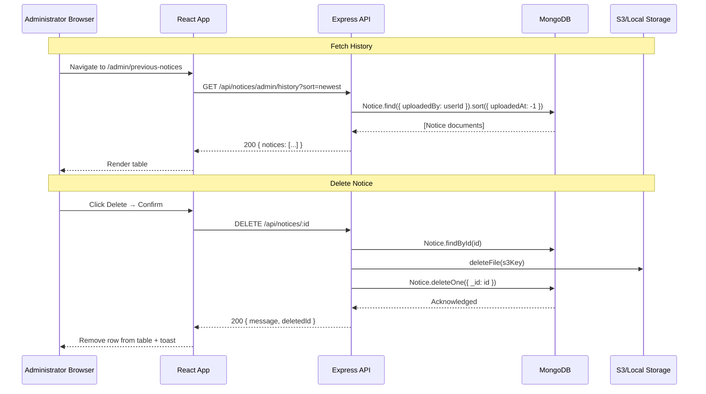

# Design Document: Previous Notices Management

## Overview

This feature adds a dedicated administrator page for viewing and managing previously uploaded notices. It introduces a new sidebar navigation item, a tabular display page with sorting and pagination, a confirmation-guarded deletion flow, and two new API endpoints — one for fetching admin notice history and one for permanently deleting notices (including associated S3/local files).

The design preserves all existing modules and endpoints unchanged. New code is additive: a new React page component, a sidebar entry, two route handlers appended to the existing `notice.routes.js`, and a new client-side route definition.

### Key Design Decisions

1. **Add endpoints to existing `notice.routes.js`** rather than creating a new route file — the notice domain is cohesive, and Express mounts all notice routes under `/api/notices` already.
2. **Client-side sorting** is rejected in favour of **server-side sorting** via a `sort` query parameter — this ensures consistent ordering across paginated results and avoids loading all notices into memory on the client.
3. **Optimistic UI removal** after deletion — the notice row is removed from state immediately upon successful API response, avoiding a full re-fetch.
4. **Reuse existing middleware** (`verifyJWT`, `requireRole`) and services (`deleteFile` from `s3.service.js`) — no new dependencies.

## Architecture



### Request Flow



## Components and Interfaces

### Server-Side Components

| Component | File | Responsibility |
|-----------|------|----------------|
| Admin History Handler | `server/src/routes/notice.routes.js` | `GET /api/notices/admin/history` — returns notices filtered by `uploadedBy`, sorted by `sort` param |
| Delete Handler | `server/src/routes/notice.routes.js` | `DELETE /api/notices/:id` — validates ownership concept (admin-only), deletes S3 file, deletes DB record |
| Auth Middleware | `server/src/middleware/auth.js` | Existing `verifyJWT` + `requireRole('administrator')` |
| S3 Service | `server/src/services/s3.service.js` | Existing `deleteFile(s3Key)` handles both S3 and local mock deletion |

### Client-Side Components

| Component | File | Responsibility |
|-----------|------|----------------|
| PreviousNoticesPage | `client/src/pages/PreviousNoticesPage.jsx` | Full-page table with sort controls, pagination, delete actions |
| ConfirmDeleteDialog | Inline in PreviousNoticesPage | Modal confirming permanent deletion |
| Sidebar (modified) | `client/src/components/Sidebar.jsx` | Adds "Previous Notices" nav item for administrator role |
| App (modified) | `client/src/App.jsx` | Adds `/admin/previous-notices` protected route |

### API Interfaces

#### GET /api/notices/admin/history

```
Headers:
  Authorization: Bearer <JWT with administrator role>

Query Parameters:
  sort: "newest" | "oldest" (default: "newest")

Response 200:
{
  "notices": [
    {
      "_id": "ObjectId",
      "fileName": "string",
      "title": "string | null",
      "summary": "string | null",
      "urgency": "critical | high | medium | low | unknown",
      "category": "academic | event | administrative | placement | unknown",
      "status": "uploaded | summarized | summary_failed | archived",
      "uploadedAt": "ISO 8601 string"
    }
  ]
}

Response 400: { "error": "Invalid sort parameter. Accepted values: newest, oldest" }
Response 401: { "error": "Authentication required" }
Response 403: { "error": "Access denied" }
```

#### DELETE /api/notices/:id

```
Headers:
  Authorization: Bearer <JWT with administrator role>

Path Parameters:
  id: MongoDB ObjectId of the notice

Response 200:
{
  "message": "Notice deleted successfully",
  "deletedId": "ObjectId"
}

Response 401: { "error": "Authentication required" }
Response 403: { "error": "Access denied" }
Response 404: { "error": "Notice not found" }
```

## Data Models

### Existing Notice Schema (unchanged)

The feature operates on the existing `Notice` model. No schema modifications are needed.

```javascript
{
  uploadedBy: ObjectId (ref: User),
  fileName: String,
  s3Key: String,
  mimeType: String,
  sizeBytes: Number,
  status: "uploaded" | "summarized" | "summary_failed" | "archived",
  summary: String | null,
  title: String | null,
  deadlines: [Date],
  actions: [String],
  urgency: "critical" | "high" | "medium" | "low" | "unknown",
  category: "academic" | "event" | "administrative" | "placement" | "unknown",
  uploadedAt: Date,
  // ... other existing fields
}
```

### Index Usage

- **Admin History query**: Uses existing `{ uploadedAt: -1 }` index for sort performance. A new compound index `{ uploadedBy: 1, uploadedAt: -1 }` is recommended for efficient filtered sorting.
- **Delete query**: Uses default `_id` index.

### Client-Side State

```typescript
// PreviousNoticesPage state
interface PageState {
  notices: Notice[];        // Current page of notices
  loading: boolean;         // Fetch in progress
  error: string | null;     // Fetch error message
  sortOrder: 'newest' | 'oldest';
  page: number;             // Current pagination page (1-indexed)
  deleteTarget: Notice | null; // Notice pending deletion (shows dialog)
  deleting: boolean;        // Delete request in progress
}
```


## Correctness Properties

*A property is a characteristic or behavior that should hold true across all valid executions of a system — essentially, a formal statement about what the system should do. Properties serve as the bridge between human-readable specifications and machine-verifiable correctness guarantees.*

### Property 1: Admin Filtering Invariant

*For any* set of notices in the database uploaded by multiple administrators, when a specific administrator queries the Admin History endpoint, all returned notices SHALL have their `uploadedBy` field equal to the requesting administrator's `userId`, and no notices belonging to other administrators SHALL appear in the results.

**Validates: Requirements 2.1, 7.3**

### Property 2: Sort Ordering Invariant

*For any* collection of notices returned by the Admin History endpoint, when `sort=newest` (or absent), the `uploadedAt` timestamps SHALL be in non-increasing (descending) order; when `sort=oldest`, the `uploadedAt` timestamps SHALL be in non-decreasing (ascending) order. Furthermore, for any two consecutive pages N and N+1, the last notice on page N SHALL have an `uploadedAt` value that is greater-than-or-equal-to (for newest) or less-than-or-equal-to (for oldest) the first notice on page N+1.

**Validates: Requirements 3.3, 3.4, 3.6, 7.5, 7.6**

### Property 3: Role-Based Access Denial

*For any* JWT token that does not contain the "administrator" role claim, requests to both the Admin History endpoint (GET /api/notices/admin/history) and the Delete endpoint (DELETE /api/notices/:id) SHALL return a 403 status code with an "Access denied" message.

**Validates: Requirements 4.7, 5.5, 7.7, 8.3**

### Property 4: Deletion Removes Record

*For any* existing notice in the database, when an authenticated administrator sends a DELETE request for that notice's identifier, the notice SHALL no longer exist in the MongoDB collection after the operation completes, and the endpoint SHALL return a 200 status with the deleted notice's identifier.

**Validates: Requirements 5.1, 8.5**

### Property 5: File Deletion Accompanies Record Deletion

*For any* notice with a valid `s3Key`, when that notice is deleted via the Delete endpoint, the system SHALL invoke file deletion for that `s3Key` in S3 or local storage. If the file does not exist, the deletion SHALL still succeed with a 200 response.

**Validates: Requirements 5.2, 5.3**

### Property 6: Deleted Notices Excluded From All Endpoints

*For any* notice that has been successfully deleted, subsequent calls to the student listing endpoint (GET /api/notices) SHALL NOT include that notice in results, and calls to the detail endpoint (GET /api/notices/:id) with the deleted notice's identifier SHALL return a 404 status.

**Validates: Requirements 6.1, 6.2**

### Property 7: Pagination Total Decreases After Deletion

*For any* state of the notices collection with total count T, after successfully deleting one notice, the total count returned by GET /api/notices SHALL equal T - 1.

**Validates: Requirements 6.4**

### Property 8: Invalid Sort Parameter Validation

*For any* string value of the `sort` query parameter that is not "newest" and not "oldest", the Admin History endpoint SHALL return a 400 status with an error message indicating accepted values.

**Validates: Requirements 7.4**

## Error Handling

### Server-Side Errors

| Scenario | Status | Response | Behaviour |
|----------|--------|----------|-----------|
| No JWT / expired / malformed | 401 | `{ "error": "Authentication required" }` | Handled by `verifyJWT` middleware |
| Non-administrator role | 403 | `{ "error": "Access denied" }` | Handled by `requireRole('administrator')` |
| Notice not found (DELETE) | 404 | `{ "error": "Notice not found" }` | Handler checks `Notice.findById()` result |
| Invalid sort parameter | 400 | `{ "error": "Invalid sort parameter. Accepted values: newest, oldest" }` | Validated at handler entry |
| S3 file missing during delete | — | Proceeds with DB deletion, returns 200 | `deleteFile` handles gracefully for local; S3 `DeleteObjectCommand` is idempotent |
| Database error | 500 | `{ "error": "Internal server error" }` | Caught by global `errorHandler` middleware |

### Client-Side Errors

| Scenario | UI Behaviour |
|----------|-------------|
| History fetch fails (network/5xx) | Show error message with "Retry" button |
| Delete fails (network/5xx) | Close dialog, show error toast, keep list unchanged |
| Delete returns 404 (already deleted) | Close dialog, show info toast, optionally remove from list |
| Unauthorized (401) | Axios interceptor redirects to /login |

### Graceful Degradation

- **S3 file missing**: The delete handler wraps `deleteFile` in a try-catch. If the file doesn't exist, the error is swallowed (local mode checks `fs.existsSync`; S3 `DeleteObjectCommand` does not error on missing keys). Deletion of the DB record proceeds.
- **Concurrent deletion**: If two admins attempt to delete the same notice simultaneously, the second request will receive a 404 response since `findById` will return null after the first deletion completes.

## Testing Strategy

### Property-Based Tests (fast-check)

The project uses Vitest + fast-check for property-based testing. Each correctness property maps to one property-based test with minimum 100 iterations.

**Library**: `fast-check` (JavaScript property-based testing framework)
**Runner**: Vitest
**Configuration**: Minimum 100 iterations per property test

| Property | Test File | Tag |
|----------|-----------|-----|
| Property 1: Admin Filtering | `server/src/__tests__/notices-admin.property.test.js` | Feature: previous-notices-management, Property 1: Admin filtering invariant |
| Property 2: Sort Ordering | `server/src/__tests__/notices-admin.property.test.js` | Feature: previous-notices-management, Property 2: Sort ordering invariant |
| Property 3: Role-Based Access | `server/src/__tests__/notices-admin.property.test.js` | Feature: previous-notices-management, Property 3: Role-based access denial |
| Property 4: Deletion Removes Record | `server/src/__tests__/notices-admin.property.test.js` | Feature: previous-notices-management, Property 4: Deletion removes record |
| Property 5: File Deletion | `server/src/__tests__/notices-admin.property.test.js` | Feature: previous-notices-management, Property 5: File deletion accompanies record deletion |
| Property 6: Deleted Notices Excluded | `server/src/__tests__/notices-admin.property.test.js` | Feature: previous-notices-management, Property 6: Deleted notices excluded from all endpoints |
| Property 7: Pagination Total | `server/src/__tests__/notices-admin.property.test.js` | Feature: previous-notices-management, Property 7: Pagination total decreases after deletion |
| Property 8: Invalid Sort Param | `server/src/__tests__/notices-admin.property.test.js` | Feature: previous-notices-management, Property 8: Invalid sort parameter validation |

### Unit Tests (Example-Based)

| Test | Scope |
|------|-------|
| Sidebar renders "Previous Notices" for admin | Component rendering |
| Sidebar does NOT render "Previous Notices" for student | Component rendering |
| Previous Notices page shows spinner while loading | UI state |
| Previous Notices page shows empty state when no data | UI state |
| Previous Notices page shows error + retry on fetch failure | UI state |
| Delete confirmation dialog opens on Delete click | UI interaction |
| Cancel dismisses dialog without API call | UI interaction |
| Sort toggle defaults to "Newest First" | UI state |
| Changing sort resets pagination to page 1 | UI state |

### Integration Tests

| Test | Scope |
|------|-------|
| Full delete flow: API call → DB removal → S3 deletion | End-to-end API |
| Admin history endpoint returns correct notices with auth | End-to-end API |
| Student cannot access admin endpoints | Auth integration |
| Existing notice upload endpoint still works after changes | Regression |
| Existing student listing endpoint schema unchanged | Regression |

### Test Infrastructure

- **Server tests**: `mongodb-memory-server` (already in devDependencies) for in-memory MongoDB during property tests
- **Client tests**: React Testing Library with mock API client
- **Property tests**: `fast-check` for input generation (to be added to devDependencies)
- **Test runner**: Vitest (to be added to devDependencies for both client and server)
